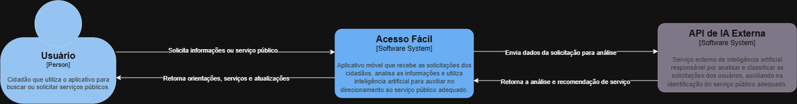
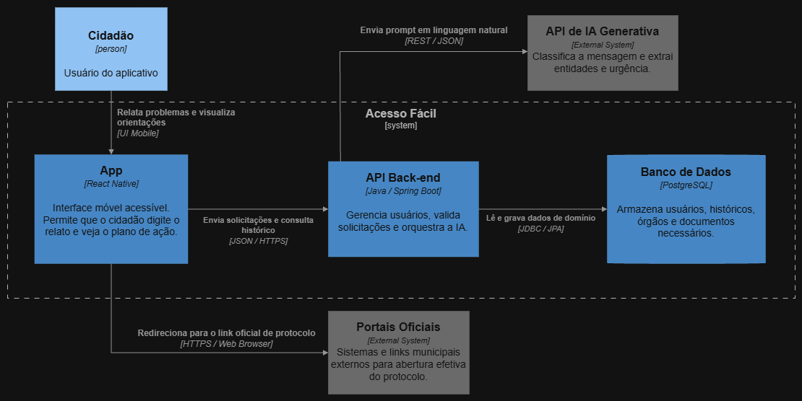

# 🏛️ Acesso Fácil — Direcionamento Inteligente aos Serviços Públicos

> **ODS 16:** Paz, Justiça e Instituições Eficazes  
> **Tecnologias:** Java (Spring Boot) | React Native | PostgreSQL | API de Inteligência Artificial

---

## 🎯 ODS Escolhida
Nosso projeto ataca a **ODS 16 — Paz, Justiça e Instituições Eficazes**.
O objetivo é fortalecer a transparência e a eficácia das instituições, garantindo que qualquer cidadão consiga exercer seus direitos e acessar os serviços públicos municipais de forma rápida, simples e inclusiva.

---

## 🛑 O Problema Real
A maioria dos cidadãos não sabe a qual órgão recorrer quando enfrenta um problema na cidade (ex: iluminação com defeito, descarte irregular de lixo, buracos em vias ou emissão de documentos). A informação existe, mas está pulverizada em diversos portais e escrita com termos burocráticos. Isso gera frustração, perda de tempo e sobrecarga nos canais de atendimento por chamados encaminhados para os setores errados.

---

## 🤖 A Solução com Inteligência Artificial
O **Acesso Fácil** elimina a necessidade de o cidadão conhecer a estrutura governamental. 
1. O usuário apenas digita seu problema em linguagem natural (ex: *"Tem um poste queimado na minha rua há três dias"*).
2. A **IA de Classificação e Extração** analisa a mensagem, identifica a **categoria**, o **nível de urgência** e o **tipo de serviço**.
3. O sistema retorna um **Plano de Ação** claro com:
   * Órgão responsável correto.
   * Passo a passo do que fazer.
   * Lista de documentos necessários.
   * Link ou canal oficial para abertura do protocolo.

*(Escopo de validação do MVP: focado em Serviços Urbanos de uma Cidade Piloto).*

---

## 👥 Público-Alvo
* **Cidadãos em geral:** Pessoas de todas as idades que necessitam de atendimento público municipal mas encontram dificuldades com termos técnicos ou burocracia.
* **Comunidades e Líderes Comunitários:** Moradores que mapeiam demandas de bairros e buscam encaminhá-las para os órgãos competentes.

---

## 📐 Modelagem Inicial (Diagrama de Classes POO)

Abaixo está o modelo de domínio da aplicação, demonstrando as entidades em Java e seus relacionamentos:

### Explicação das Entidades (POO):
* **Usuario:** Cidadão que utiliza o aplicativo para relatar problemas (`1` para `0..*` Solicitacao).
* **Solicitacao:** Registra o relato em linguagem natural feito pelo cidadão (`1` para `1` AnaliseIA).
* **AnaliseIA:** Representa o processamento do modelo generativo, armazenando a categoria identificada, o grau de urgência e a recomendação técnica (`1` para `1` ServicoPublico).
* **ServicoPublico:** Mapeia o serviço municipal (ex: Iluminação Pública, Tapa-Buracos) (`*` para `1` OrgaoPublico e `1` para `0..*` Documento).
* **OrgaoPublico:** Entidade responsável pelo atendimento (ex: Secretaria de Obras, Prefeitura Bairro).
* **Documento:** Relação de documentos/comprovantes necessários para a solicitação.

---

## 🏗️ Arquitetura do Sistema (C4 Model)

Para detalhar a arquitetura técnica e o fluxo de dados do **Acesso Fácil**, utilizamos a notação do **C4 Model**.

### **Nível 1: Diagrama de Contexto**
Apresenta a visão geral do sistema, o cidadão utilizando a aplicação e a integração com a API externa de inteligência artificial.

### **Nível 2: Diagrama de Contêineres**
Detalha os limites da aplicação e os papéis das tecnologias da stack (**React Native**, **Spring Boot**, **PostgreSQL** e as APIs externas).

